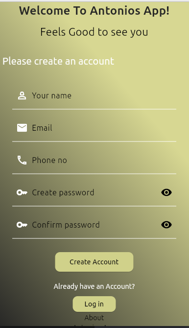
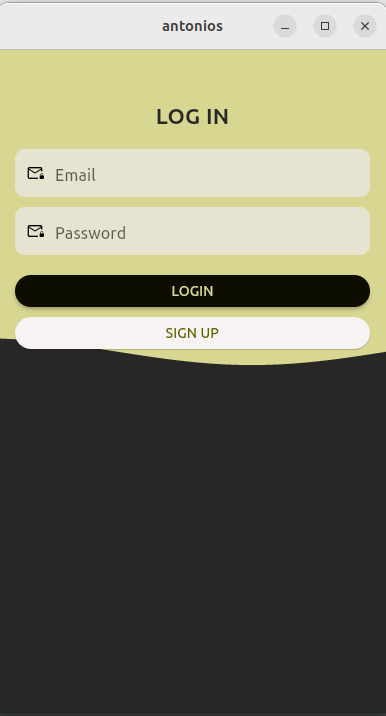
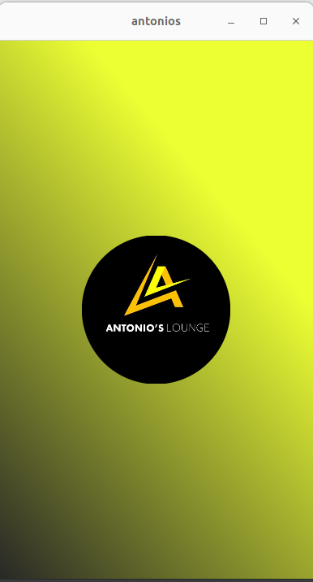

# Antonios_Sports_Lounge Mobile App






## Table of Contents

- [Introduction](#introduction)
- [Features](#features)
- [Getting Started](#getting-started)
    - [Prerequisites](#prerequisites)
    - [Installation](#installation)
- [Usage](#usage)
- [Contributing](#contributing)
- [License](#license)

## Introduction

The Antonios Club Mobile App is a Flutter-based application designed to enhance the club members' experience by providing a convenient platform for accessing club information, events, and engaging with fellow members.

## Features

- Membership management, including registration and renewals.
- News and updates feed.
- Social interaction and messaging.
- Membership directory.
- Club information and history.
- Galleries and media sharing.
- Polls and surveys.
- Admin panel for content management.
- Security and privacy features.
- Cross-platform (iOS and Android) support.

## Getting Started

### Prerequisites

Before you begin, ensure you have met the following requirements:

- Flutter and Dart installed on your development machine.
- An Android emulator or a physical Android device for Android development.
- An iOS simulator or a physical iOS device for iOS development (if applicable).
- Code editor or IDE (e.g., Visual Studio Code, Android Studio).

### Installation

1. Clone the repository:

   ```shell
   git clone https:'repo url'


A few resources to get you started if this is your first Flutter project:

- [Lab: Write your first Flutter app](https://docs.flutter.dev/get-started/codelab)
- [Cookbook: Useful Flutter samples](https://docs.flutter.dev/cookbook)

For help getting started with Flutter development, view the
[online documentation](https://docs.flutter.dev/), which offers tutorials,
samples, guidance on mobile development, and a full API reference.
# Antonios_Sports_Lounge

